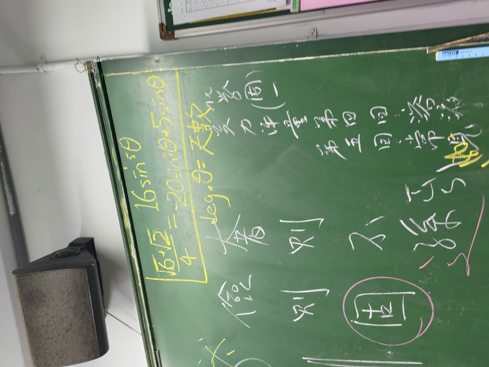
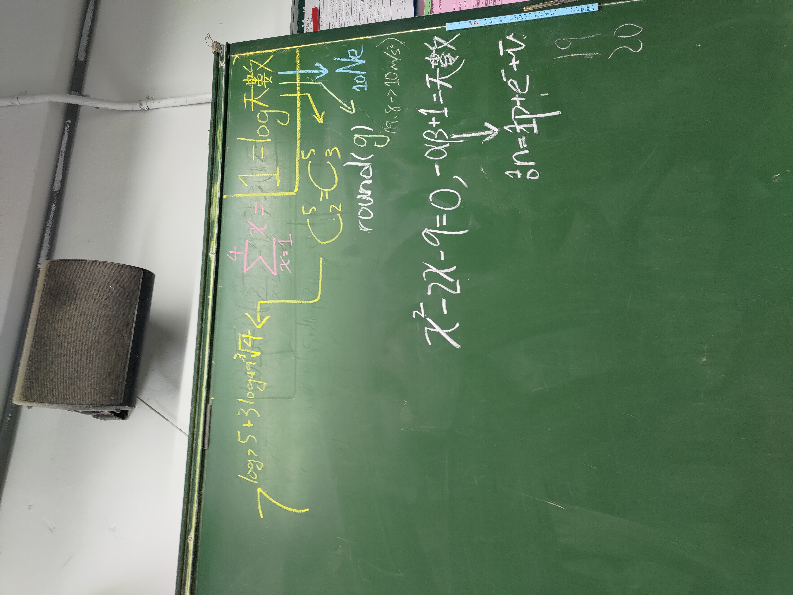
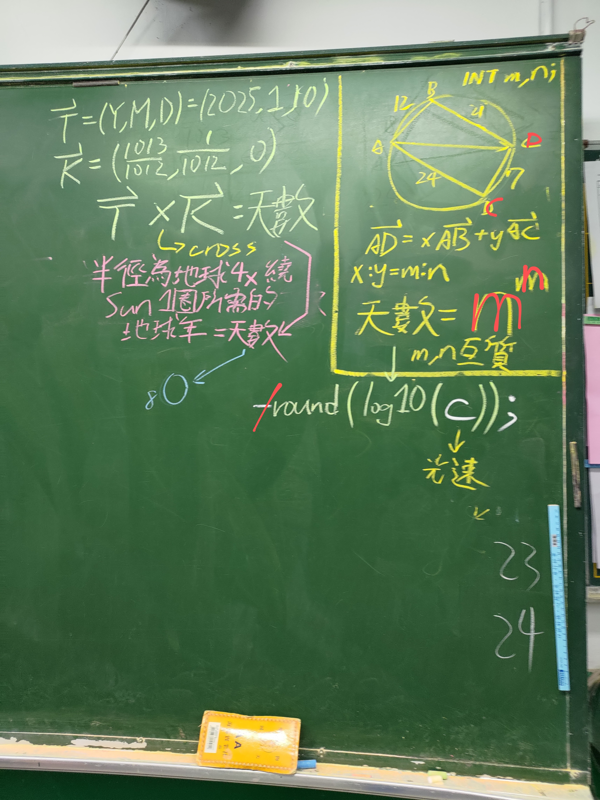
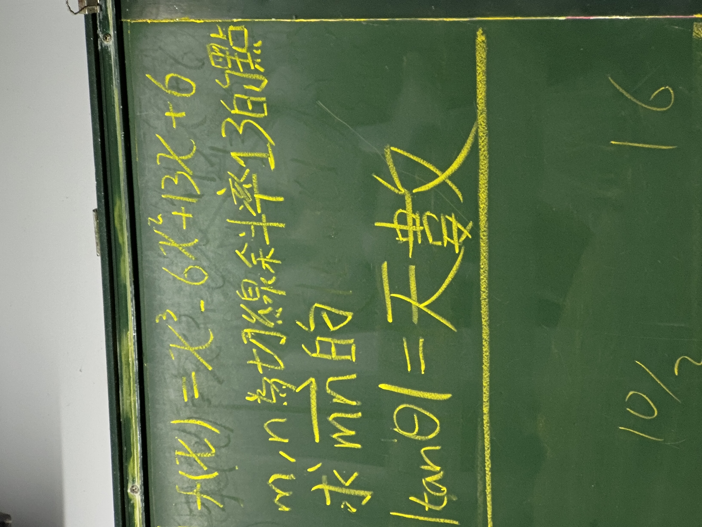

# 關於學測與分科倒數
適用於多數情況直到教育政策改善 
這仍在班上電腦執行，且只要開機就會跳出，還附上彩蛋。

## 動機
因為黑板上已經開始有學測倒數天數，進而促使我寫出這程式，並設定在開機後自動執行，使得同學能進入狀態並認真學習。除此之外，我還加了一些亮點在裡面，讓他們自行探索並從中獲得樂趣。

## 過程
因為我有在學校放筆電的習慣(該筆電只要700元)，因此用自己的電腦就直接寫出；過程中因為忘記tkinter的語法，而有給ChatGPT其他條件(那時是叫它寫時間顯示)並參考它的語法與自研部分邏輯。至於惡趣味詞語是後來想到的，考前同學常說"包一包"、"回家睡"等消極詞語，我也把它們收錄進此程式，增加爆點使其增添樂趣。

## 心得
這算是自己想到的，在二年級時也是用Python寫出開機後隨機挑選並打開同學的圖片或影片(檔案由同學提供)，因此在這一部分是沒有太大的難度，唯一的需求就是要有網路。然後有"再加個365"是同學每次看到有人不認真時的"口頭提醒"。我在這裡的點子幾乎都是日常同學的言行啟發，並且因為我具有一定的programing基礎，才能快速完成這個我自己想做的東西。後來甚至做了偵測IP和gateway以讓我的筆電直接使用學校網路。這舉動也讓老師注意到我，~~發現我似乎太閒，因此拿了5級單字讓我背(X~~，也讓我用此能力驗證課堂上所講解的內容(例如酸鹼滴定)。
 
 
 
 
 

# Oh對了，黑板上的倒數也被我魔改
因為我的打掃工作是清理黑板與講台，因此可以動用privilege。題目通常是自訂，翻講義隨機挑選一章做題；有些是同學不會的題目稍加修改。學測數學頂標有可能是因此造成。

  
   

  
   

  
   

  
   

  
   

  
   

  
   

